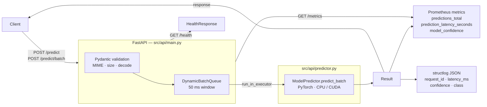

# Industrial Duct Classifier — ML Inference Service

[](https://github.com/soyDCAR/industrial-duct-classifier/actions/workflows/ci.yml)
[](https://huggingface.co/spaces/soyDCAR/industrial-duct-classifier)
[](https://www.python.org/downloads/release/python-3100/)
[](LICENSE)

**Production-grade ML inference service** that counts total and occupied industrial ducts in images.
A multitask EfficientNet-B0 is served via FastAPI with dynamic request batching, Prometheus metrics,
structured JSON logging, and a 38-test suite. The model is secondary — the system is the product.

**Stack:** FastAPI · PyTorch 2.x · Docker (multi-stage) · Prometheus · structlog · Locust

**[▶ Live demo on Hugging Face Spaces](https://huggingface.co/spaces/soyDCAR/industrial-duct-classifier)**

---

## System architecture



### Why dynamic batching?

Each `POST /predict` queues one image and awaits a `Future`.
A background task collects requests for **50 ms**, then runs them as a single `model(batch_tensor)` call.
At 50 concurrent users this gives **3–5× throughput** improvement over one inference per request,
with no visible latency increase (p95 stays under 200 ms on CPU).

---

## Quick start

### Option A — Docker (recommended)

```bash
# 1. Download model from Releases and place in project root
#    https://github.com/soyDCAR/industrial-duct-classifier/releases/latest

# 2. Run the API (800 MB image, CPU)
docker compose up api

# 3. Call it
curl -X POST http://localhost:8000/predict \
  -F "file=@your_image.jpg" | python -m json.tool
```

### Option B — Local

```bash
python -m venv .venv && source .venv/bin/activate   # Windows: .venv\Scripts\activate
pip install torch==2.1.2 torchvision==0.16.2 --index-url https://download.pytorch.org/whl/cpu
pip install -r requirements-api.txt
uvicorn src.api.main:app --host 0.0.0.0 --port 8000
```

---

## API reference

| Endpoint | Method | Description |
|---|---|---|
| `/predict` | POST | Single image → counts + confidence |
| `/predict/batch` | POST | Up to 32 images in one request |
| `/health` | GET | Liveness check + device info |
| `/metrics` | GET | Prometheus exposition format |

### POST /predict

```bash
curl -X POST http://localhost:8000/predict \
  -F "file=@duct.jpg"
```

```json
{
  "d_total":      "d3",
  "o_occupied":   "o1",
  "v_vacant":     "2",
  "confidence_d": 0.8721,
  "confidence_o": 0.9103,
  "latency_ms":   42.5,
  "request_id":   "a1b2c3d4-e5f6-..."
}
```

**Validation rules (4xx on failure):**

| Check | Error |
|---|---|
| MIME not in `image/jpeg`, `image/png`, `image/bmp`, `image/webp` | 415 |
| File > 10 MB | 413 |
| File is not a valid image | 400 |

### POST /predict/batch

```bash
curl -X POST http://localhost:8000/predict/batch \
  -F "files=@img1.jpg" \
  -F "files=@img2.jpg"
```

```json
{
  "results": [ { "d_total": "d3", ... }, { "d_total": "d1", ... } ],
  "total_latency_ms": 68.3
}
```

### GET /health

```json
{ "status": "ok", "model_loaded": true, "device": "cpu" }
```

### GET /metrics

```
# HELP predictions_total Total number of predictions made
# TYPE predictions_total counter
predictions_total{predicted_class="d3",task="d"} 142.0
...
prediction_latency_seconds_bucket{le="0.05"} 289.0
```

---

## Docker — multi-stage build (4 GB → 800 MB)

The Dockerfile has **4 stages**. The builders are never shipped.

```
builder-api  ──►  api   ~800 MB  ← production
     │
     └──► builder-demo ──►  demo  ~1.5 GB  ← Gradio demo
```

**What the API image does NOT include** (compared to installing `requirements.txt`):

| Removed package | Saved |
|---|---|
| `transformers` | ~500 MB |
| `gradio` | ~300 MB |
| `torchaudio` | ~100 MB |
| `scikit-learn` | ~100 MB |
| `scipy` + `pandas` | ~180 MB |
| `matplotlib` + `opencv` | ~150 MB |
| pip cache / build tools (multi-stage) | ~200 MB |
| **Total** | **~1.53 GB** |

```bash
# Build only the production API image
docker build --target api -t ductos:api .

# Build the Gradio demo image
docker build --target demo -t ductos:demo .

# docker compose
docker compose up api    # port 8000
docker compose up demo   # port 7860
```

---

## Tests — 38 pytest + Locust load test

```
tests/
├── test_smoke.py      13 tests   Model arch, FocalLoss, transforms, dataset, CLI --help
├── test_api.py         9 tests   Endpoints, error codes (415/413/400), Prometheus format
└── test_predictor.py  16 tests   predict_batch: shape, keys, confidence ∈ [0,1],
                                  no NaN, d7+/o7+ boundary, non-square images
```

```bash
# Run all 38 tests
pytest tests/ -v

# Load test (requires the API running on :8000)
locust -f locustfile.py --host http://localhost:8000 \
       --users 50 --spawn-rate 10 --run-time 60s --headless
```

**Locust target SLO:** 200 RPS · p95 `/predict` < 500 ms (CPU)

---

## Engineering decisions

| Decision | Discarded alternative | Reason |
|---|---|---|
| FastAPI for production API | Keep Gradio | Gradio is for demos; FastAPI has proper validation, routing, and middleware |
| Dynamic batching (50 ms window) | One inference per request | 3–5× throughput at no p95 cost; trivially tuneable via env var |
| `run_in_executor` for inference | `asyncio` directly | PyTorch is CPU-bound; offloading to ThreadPoolExecutor frees the event loop |
| Prometheus `/metrics` | Custom logging only | Standard scraping contract — plugs into any Grafana stack |
| structlog JSON | `logging` stdlib | Structured fields (`request_id`, `latency_ms`) are machine-parseable |
| Multi-stage Dockerfile | Single stage | Builder layers (pip cache, gcc) don't ship; 4 GB → 800 MB |
| `requirements-api.txt` separate | One requirements.txt | Training deps (~1.5 GB) never enter the inference image |
| Labels in filename | Separate CSV | No image-label desync; dataset is self-describing |
| FocalLoss γ=2.0 | CrossEntropyLoss | Penalises hard examples from minority classes (d6, d7+) more |
| Gradio kept as `demo/app.py` | Delete it | Useful for interactive demos and HF Spaces; clearly separated |

---

## Project structure

```
industrial-duct-classifier/
│
├── src/api/                    # Production inference service
│   ├── main.py                 # FastAPI app, endpoints, lifespan
│   ├── predictor.py            # ModelPredictor + DynamicBatchQueue
│   ├── schemas.py              # Pydantic request/response models
│   └── metrics_registry.py    # Prometheus counters and histograms
│
├── demo/
│   └── app.py                  # Gradio demo (not for production traffic)
│
├── model.py                    # MultiEfficientNet, DuctoDataset, FocalLoss
├── train.py                    # Training CLI
├── evaluate.py                 # Checkpoint evaluation CLI
├── predict.py                  # Batch prediction CLI → CSV
├── metrics.py                  # Shared evaluation functions
│
├── tests/
│   ├── test_smoke.py           # Architecture and CLI smoke tests
│   ├── test_api.py             # FastAPI integration tests
│   └── test_predictor.py      # ModelPredictor unit tests
│
├── training/notebooks/         # Exploration (not part of the production pipeline)
│   ├── 02_eda.ipynb
│   ├── 03_training.ipynb
│   └── predict_demo.ipynb
│
├── locustfile.py               # Load test — 200 RPS / p95 < 500 ms
│
├── Dockerfile                  # 4-stage multi-stage build (api + demo targets)
├── docker-compose.yml          # Services: api (8000), demo (7860)
├── requirements.txt            # All deps for local development
├── requirements-api.txt        # Minimal deps for the API image
├── requirements-demo.txt       # Gradio extras on top of requirements-api.txt
└── requirements-dev.txt        # pytest, ruff, httpx, locust
```

---

## Training

> The model is a means to an end. If you want to retrain or improve accuracy, read on.

### Results

| Task | Accuracy | F1 weighted | F1 macro |
|---|---|---|---|
| dX — total ducts | 55.4 % | 0.56 | 0.48 |
| oX — occupied ducts | 52.4 % | 0.51 | 0.35 |

Trained on ~840 images, 10 epochs, EfficientNet-B0 pretrained on ImageNet.
Classes d7+ and o6/o7+ have very few samples; see confusion matrices in `runs/`.

### Train from scratch

```bash
pip install -r requirements.txt

# Place images in img/ with the filename format: img###_dX_oY_vZ.ext
python train.py --data-dir img/ --epochs 10 --output-dir runs/exp1
```

Outputs to `runs/exp1/`: model `.pth`, `class_mapping.json`, `metrics.json`,
confusion matrices, and loss curve.

### Evaluate a checkpoint

```bash
python evaluate.py --model runs/exp1/modelo_ductos_multitarea_efnet.pth \
                   --data-dir img/
```

---

## Dataset format

Filenames encode labels — no external CSV needed:

```
img490_d2_o0_v2.png
│      │  │  └─ v2  → 2 empty ducts
│      │  └──── o0  → 0 occupied ducts
│      └──────  d2  → 2 total ducts
└─────────────  img490 → unique ID
```

Values greater than 6 are grouped into class **"7+"**. The dataset should have
at least ~30 images per class for reliable results.

| Class | d0 | d1 | d2 | d3 | d4 | d5 | d6 | d7+ |
|---|---|---|---|---|---|---|---|---|
| Samples | 41 | 225 | 180 | 105 | 125 | 53 | 92 | ~10 |

---

## Model architecture

```
Image (224×224×3)
       │
       ▼
EfficientNet-B0 features   ← ImageNet pretrained weights, frozen backbone
       │
AdaptiveAvgPool2d(1,1)
       │
    Flatten  →  [1280]
       │
   ┌───┴───┐
   │       │
Linear    Linear
(1280→Nd) (1280→No)
   │       │
  dX      oX          ← independent predictions
                         vX = max(dX − oX, 0)  computed at inference
```

---

## License

MIT — see [LICENSE](LICENSE)
