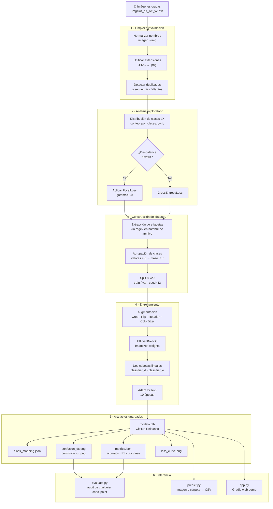

# Clasificador de Ductos — EfficientNet-B0 Multitarea

[](https://github.com/soyDCAR/industrial-duct-classifier/actions/workflows/ci.yml)

Clasificación automática de imágenes de ductos industriales mediante una red neuronal
multitarea. El modelo predice simultáneamente el número de ductos totales (**dX**) y
ocupados (**oX**) a partir de una sola pasada por la red.

**Stack:** Python 3.10 · PyTorch 2.x · EfficientNet-B0 · Gradio · scikit-learn · Docker

---

## Demo


> Sube una imagen → el modelo predice ductos totales, ocupados y vacíos en tiempo real.

```bash
python app.py
# Abre http://localhost:7860
```

---

## Resultados

| Tarea | Accuracy | F1 weighted | F1 macro |
|---|---|---|---|
| dX — ductos totales | 55.4 % | 0.56 | 0.48 |
| oX — ductos ocupados | 52.4 % | 0.51 | 0.35 |

> Entrenado sobre ~840 imágenes, 10 épocas, EfficientNet-B0 preentrenado en ImageNet.
> Las clases d7+ y o6/o7+ tienen muy pocas muestras; ver matrices de confusión en `runs/`.

---

## Pipeline de datos

El pipeline completo va desde imágenes crudas con nombres codificados hasta un modelo
desplegado. Cada etapa tiene su script o notebook independiente.



### Decisiones de ingeniería

| Decisión | Alternativa descartada | Razón |
|---|---|---|
| Etiquetas en el nombre del archivo | CSV de etiquetas separado | Sin riesgo de desincronización imagen-label |
| Clases agrupadas en "7+" | Mantener clases raras | Clases con < 5 muestras no son aprendibles |
| FocalLoss γ=2.0 | CrossEntropyLoss estándar | Penaliza más los ejemplos difíciles de clases minoritarias |
| Dos cabezas independientes | Dos modelos separados | Un solo forward pass, features compartidas |
| `class_mapping.json` generado al entrenar | Hardcoded en código | El mapeo cambia si el dataset cambia |

---

## Estructura del proyecto

```
industrial-duct-classifier/
├── model.py            # Arquitectura: MultiEfficientNet, DuctoDataset, FocalLoss
├── train.py            # Entrenamiento con argparse
├── evaluate.py         # Evaluación de cualquier checkpoint guardado
├── predict.py          # Inferencia: imagen individual o carpeta → CSV
├── app.py              # Demo Gradio (web interactiva)
│
├── requirements.txt    # Dependencias pip
├── environment.yml     # Entorno conda reproducible
├── Dockerfile          # CPU por defecto; --build-arg CUDA=1 para GPU
├── docker-compose.yml
│
├── assets/
│   └── demo.gif        # Captura de la demo Gradio
│
├── runs/               # Artefactos de entrenamiento (ignorado por Git)
│   └── exp1/
│       ├── modelo_ductos_multitarea_efnet.pth  → subir a Releases
│       ├── class_mapping.json
│       ├── metrics.json
│       ├── loss_curve.png
│       ├── confusion_dx.png
│       └── confusion_ox.png
│
└── notebooks/          # Exploración (no son parte del pipeline de producción)
    ├── Entrenamiento_modelo.ipynb
    ├── Predecir_imagen.ipynb
    └── conteo_por_clases.ipynb
```

---

## Instalación

**Opción A — conda (recomendado):**
```bash
conda env create -f environment.yml
conda activate ductos_env
```

**Opción B — pip:**
```bash
python -m venv .venv
source .venv/bin/activate      # Windows: .venv\Scripts\activate
pip install -r requirements.txt
```

**Descargar el modelo preentrenado:**
```bash
# Descarga modelo_ductos_multitarea_efnet.pth y class_mapping.json desde:
# https://github.com/soyDCAR/industrial-duct-classifier/releases/latest
# Colócalos en la raíz del proyecto.
```

---

## Uso

### Entrenar desde cero
```bash
# Coloca tus imágenes en img/ con el formato img###_dX_oY_vZ.ext
python train.py --data-dir img/ --epochs 10 --output-dir runs/exp1
```
Genera en `runs/exp1/`: modelo `.pth`, `class_mapping.json`, `metrics.json`,
matrices de confusión y curva de pérdida.

### Evaluar un checkpoint
```bash
python evaluate.py --model runs/exp1/modelo_ductos_multitarea_efnet.pth \
                   --data-dir img/
```

### Predecir
```bash
# Imagen individual
python predict.py imagen.jpg

# Carpeta completa → CSV
python predict.py img/ --batch --output resultados.csv
```

### Demo web
```bash
python app.py
# Con link público temporal:
python app.py --share
```

### Docker
```bash
# CPU
docker build -t ductos .
docker run --rm -p 7860:7860 \
  -v ./modelo_ductos_multitarea_efnet.pth:/app/modelo_ductos_multitarea_efnet.pth \
  -v ./class_mapping.json:/app/class_mapping.json \
  ductos python app.py

# GPU (requiere nvidia-container-toolkit)
docker build --build-arg CUDA=1 -t ductos-gpu .
```

---

## Formato del dataset

Los nombres de archivo codifican las etiquetas — no se necesita CSV externo:

```
img490_d2_o0_v2.png
│      │  │  └─ v2  → 2 ductos vacíos
│      │  └──── o0  → 0 ductos ocupados
│      └──────  d2  → 2 ductos totales
└─────────────  img490 → ID único
```

Valores mayores a 6 se agrupan en la clase **"7+"** para ambas tareas.
El dataset debe tener al menos ~30 imágenes por clase para resultados fiables.

**Distribución del dataset de referencia (~840 imágenes):**

| Clase | d0 | d1 | d2 | d3 | d4 | d5 | d6 | d7+ |
|---|---|---|---|---|---|---|---|---|
| Muestras | 41 | 225 | 180 | 105 | 125 | 53 | 92 | ~10 |

> El fuerte desbalance hacia d1 y d2 justifica el uso de FocalLoss.

---

## Arquitectura del modelo

```
Imagen (224×224×3)
       │
       ▼
EfficientNet-B0 features   ← pesos ImageNet congelados inicialmente
       │
AdaptiveAvgPool2d(1,1)
       │
    Flatten  →  [1280]
       │
   ┌───┴───┐
   │       │
Linear    Linear
(1280→Nd) (1280→No)
   │       │
  dX      oX          ← predicciones independientes
                         vX = max(dX - oX, 0)  calculado en inferencia
```

---

## Licencia

MIT
