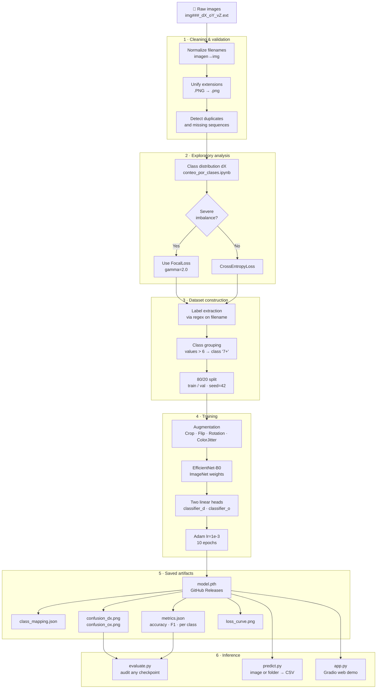

# Industrial Duct Classifier — EfficientNet-B0 Multitask

[](https://github.com/soyDCAR/industrial-duct-classifier/actions/workflows/ci.yml)
[](LICENSE)

Automatic classification of industrial duct images using a multitask neural network.
The model simultaneously predicts the total number of ducts (**dX**) and the number of
occupied ducts (**oX**) in a single forward pass through a shared EfficientNet-B0 backbone.

**Stack:** Python 3.10 · PyTorch 2.x · EfficientNet-B0 · Gradio · scikit-learn · Docker

---


---

## Quick start

```bash
# 1. Install dependencies
python -m venv .venv
source .venv/bin/activate      # Windows: .venv\Scripts\activate
pip install -r requirements.txt

# 2. Download the pretrained model from Releases and place it in the project root:
#    https://github.com/soyDCAR/industrial-duct-classifier/releases/latest

# 3. Launch the web demo
python app.py
# Open http://localhost:7860
```

---

## Results

| Task | Accuracy | F1 weighted | F1 macro |
|---|---|---|---|
| dX — total ducts | 55.4 % | 0.56 | 0.48 |
| oX — occupied ducts | 52.4 % | 0.51 | 0.35 |

> Trained on ~840 images, 10 epochs, EfficientNet-B0 pretrained on ImageNet.
> Classes d7+ and o6/o7+ have very few samples; see confusion matrices in `runs/`.

---

## Data pipeline

The full pipeline goes from raw images with encoded filenames to a deployed model.
Each stage has its own independent script or notebook.



### Engineering decisions

| Decision | Discarded alternative | Reason |
|---|---|---|
| Labels encoded in filename | Separate CSV file | No risk of image-label desync |
| Classes grouped into "7+" | Keep rare classes | Classes with < 5 samples are not learnable |
| FocalLoss γ=2.0 | Standard CrossEntropyLoss | Penalizes harder examples from minority classes more |
| Two independent heads | Two separate models | Single forward pass, shared features |
| `class_mapping.json` generated at training | Hardcoded in source | Mapping changes if dataset changes |

---

## Project structure

```
industrial-duct-classifier/
├── model.py            # Architecture: MultiEfficientNet, DuctoDataset, FocalLoss
├── train.py            # Training CLI with argparse
├── evaluate.py         # Evaluate any saved checkpoint
├── predict.py          # Inference: single image or folder → CSV
├── app.py              # Gradio web demo
├── metrics.py          # Reusable evaluation functions
│
├── requirements.txt    # Production dependencies
├── requirements-dev.txt # Dev tools (pytest, ruff — pinned versions)
├── Dockerfile          # CPU by default; --build-arg CUDA=1 for GPU
│
├── assets/
│   └── demo.gif        # Gradio demo screencast (coming soon)
│
├── runs/               # Training artifacts (git-ignored)
│   └── exp1/
│       ├── modelo_ductos_multitarea_efnet.pth  → upload to Releases
│       ├── class_mapping.json
│       ├── metrics.json
│       ├── loss_curve.png
│       ├── confusion_dx.png
│       └── confusion_ox.png
│
└── notebooks/          # Exploration (not part of the production pipeline)
    ├── Entrenamiento_modelo.ipynb
    ├── Predecir_imagen.ipynb
    └── conteo_por_clases.ipynb
```

---

## Installation

**Option A — pip:**
```bash
python -m venv .venv
source .venv/bin/activate      # Windows: .venv\Scripts\activate
pip install -r requirements.txt
```

**Option B — conda:**
```bash
conda env create -f environment.yml
conda activate ductos_env
```

**Download the pretrained model:**
```bash
# Download modelo_ductos_multitarea_efnet.pth and class_mapping.json from:
# https://github.com/soyDCAR/industrial-duct-classifier/releases/latest
# Place both files in the project root.
```

---

## Usage

### Train from scratch
```bash
# Place your images in img/ using the format: img###_dX_oY_vZ.ext
python train.py --data-dir img/ --epochs 10 --output-dir runs/exp1
```
Outputs to `runs/exp1/`: model `.pth`, `class_mapping.json`, `metrics.json`,
confusion matrices, and loss curve.

### Evaluate a checkpoint
```bash
python evaluate.py --model runs/exp1/modelo_ductos_multitarea_efnet.pth \
                   --data-dir img/
```

### Predict
```bash
# Single image
python predict.py imagen.jpg

# Full folder → CSV
python predict.py img/ --batch --output results.csv
```

### Web demo
```bash
python app.py
# With a temporary public link:
python app.py --share
```

### Docker
```bash
# CPU
docker build -t ductos .
docker run --rm -p 7860:7860 \
  -v ./modelo_ductos_multitarea_efnet.pth:/app/modelo_ductos_multitarea_efnet.pth \
  -v ./class_mapping.json:/app/class_mapping.json \
  ductos python app.py

# GPU (requires nvidia-container-toolkit)
docker build --build-arg CUDA=1 -t ductos-gpu .
```

---

## Dataset format

Filenames encode labels — no external CSV needed:

```
img490_d2_o0_v2.png
│      │  │  └─ v2  → 2 empty ducts
│      │  └──── o0  → 0 occupied ducts
│      └──────  d2  → 2 total ducts
└─────────────  img490 → unique ID
```

Values greater than 6 are grouped into class **"7+"** for both tasks.
The dataset should have at least ~30 images per class for reliable results.

**Reference dataset distribution (~840 images):**

| Class | d0 | d1 | d2 | d3 | d4 | d5 | d6 | d7+ |
|---|---|---|---|---|---|---|---|---|
| Samples | 41 | 225 | 180 | 105 | 125 | 53 | 92 | ~10 |

> The strong imbalance toward d1 and d2 justifies using FocalLoss.

---

## Model architecture

```
Image (224×224×3)
       │
       ▼
EfficientNet-B0 features   ← ImageNet pretrained weights
       │
AdaptiveAvgPool2d(1,1)
       │
    Flatten  →  [1280]
       │
   ┌───┴───┐
   │       │
Linear    Linear
(1280→Nd) (1280→No)
   │       │
  dX      oX          ← independent predictions
                         vX = max(dX - oX, 0)  computed at inference
```

---

## License

MIT — see [LICENSE](LICENSE)
